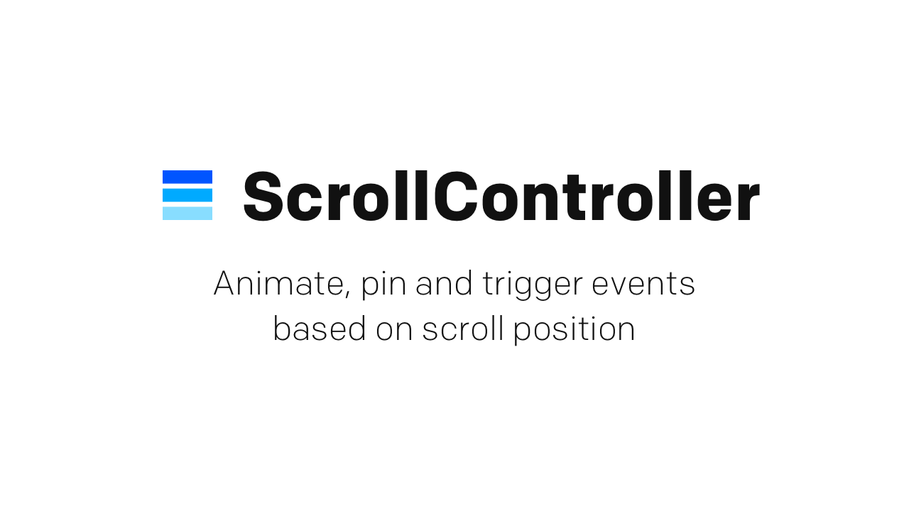
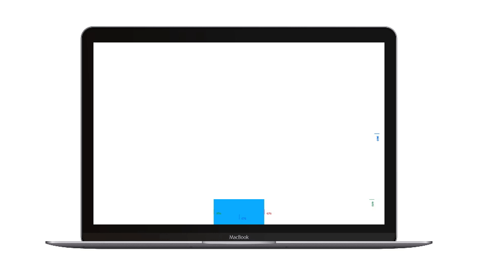

# ScrollController

ScrollController is a Framer module that helps you to animate, pin and trigger events based on scroll position. It's the module you need, if you want to:

- animate based on scroll position
- start an animation at a specific scroll position
- synchronise an animation to the scroll movement
- pin a layer indefinitely at a specific scroll position
- pin a layer for a limited amount of scroll progress
- add callbacks at specific scroll positions passing a progress parameter
- easily create parallax effect
- create infinite scrolling
- create sticky headers

_Works with [Framer](https://framer.com) v120 or later_

#### Table of contents
[Installation](#installation)  
[Demo](#demo)  
[Quick start](#quick-start)  
[Documentation](#documentation)  
[Known limitations](#known-limitations)  
[Releases](#releases)  
[License](#license)  
[Author](#author)  
[Acknowledgement](#acknowledgement)  

## Installation

#### Install with Framer Modules

1. Open your project in Framer.
2. Start Framer Modules and select `ADD MODULE`.
3. Search for `ScrollController`, once found hit enter to install into your prototype.

<a href='https://open.framermodules.com/scrollcontroller'>
    
</a>

#### Install manually

1. Open your project in Framer.
2. Download and unzip the module.
3. Drag the file `ScrollController.coffee` into the code editor.
4. Change `ScrollController` to `{ScrollController}` in the require command

<a href="https://github.com/jbentzen/framer-scrollcontroller/releases/download/v1.0.1/scrollcontroller.zip">
  
</a>

## Demo



## Quick start
To get started using the `ScrollController` you must start by creating a `Controller` to make the required connection to the `ScrollComponent`. Secondly you must add at least one `Scene` which defines in what part of the page/view something should happen. Finally you may add at least one `Tween` or `Pin` to define what needs to happen. Alternatively you may listen for events with callbacks to trigger your prototype.

##### Step 1: Import module
```coffee
# Import module
{ScrollController} = require 'ScrollController'
```

##### Step 2: Create setting (with built-in components)  
```coffee
# Create ScrollComponent
myScrollComponent = new ScrollComponent
	frame: Screen.frame
	scrollHorizontal: false

# Create container
myContainer = new Layer
	parent: myScrollComponent.content
	width: Screen.width
	height: Screen.height*2
	backgroundColor: null

# Create layer
myLayer = new Layer
	parent: myContainer
	point: Align.center
```

##### Step 3: Create controller and add scene, tween and pin
```coffee
# Create controller
myController = new ScrollController
	source: myScrollComponent

# Add scene
myScene = myController.addScene
	triggerLayer: myLayer
	duration: 200
	guide: true

# Add tweeen
myTween = myScene.addTween
	to: {rotation: -90, scale: 0.2, backgroundColor: "#00AAFF"}
	options: {time: 0.25, curve: "Spring"}

# Add pin
myPin = myScene.addPin()
```


##### Step 4: Listen for events with callback
```coffee
# Listen for event with callback
myScene.onProgress (event, instance) ->
  myTextLayer.text = "#{event.progress}"
```

## Documentation
ScrollController consists of 4 components: `Controller`, `Scene`, `Tween` and `Pin`. Learn about each components and its properties in the documentation:

#### Components
[Controller](#controller)  
[Scene](#scene)  
[Tween](#tween)  
[Pin](#pin)

### Controller
The controller establishes the required connection to the ScrollComponent and manages attached scenes by either updating or refreshing them whenever the ScrollComponent changes its size or when its scroll position changes. The controller manages one direction - create two controllers if you need to manage both horizontal and vertical movement at the same time.

| Property | Type | Default | Description |
| :--- | :--- | :--- | :--- |
| [`new ScrollController`](#new-scrollcontroller) | Class | - | Create controller |
| `Controller.source` | Object | - | Get controller source |
| `Controller.name` | String | `"."` | Get/Set controller name |
| `Controller.direction` | String | `"vertical"` | Get controller scroll direction |
| `Controller.throttle` | Number | `0` | Get/Set controller throttling |
| `Controller.enabled` | Boolean | `true` | Get/Set controller enabled state |
| [`Controller.addScene`](#controlleraddscene) | Method | - | Add scene to controller |
| [`Controller.removeScene`](#controllerremovescene) | Method | - | Remove scene from controller |
| [`Controller.scrollTo`](#controllerscrollto) | Method | - | Scroll to scene, progress, layer or offset |
| [`Controller.update`](#controllerupdate) | Method | - | Force controller update |
| [`Controller.refresh`](#controllerrefresh) | Method | - | Force controller refresh |
| [`Controller.remove`](#controllerremove) | Method | - | Remove controller |

#### new ScrollController
Create controller.

##### Parameters:
- `source` – ScrollComponent instance – _required_
- `name` – controller name
- `direction` – controller scroll direction
- `throttle` – controller throttling
- `enabled` – controller enabled state

```coffee
# Create controller with default properties
myController = new ScrollController
  source: myScrollComponent

# Create controller with custom properties
myController = new ScrollController
  source: myScrollComponent
  name: "myControllerName"
  direction: "horizontal"
  throttle: 0.01
  enabled: false
```

#### Controller.addScene
Add scene to controller.

##### Parameters:
- `name` – scene name
- `triggerLayer` – scene triggerLayer to define the start of the scene
- `offset` – scene offset, from top/left of screen or from triggerLayer
- `duration` – scene duration
- `needle` – scene needle position, from begining to end of screen (0 to 1)
- `reverse` – scene reversable state
- `enabled` – scene enabled state
- `guide` – scene guide markers
- `guideNeedleColor` – scene guide needle color
- `guideStartColor` – scene guide start color
- `guideEndColor` – scene guide end color
- `guideIndent` – scene guide indent

```coffee
# Add scene to controller with default properties
myScene = myController.addScene()

# Add scene to controller with custom properties
myScene = myController.addScene
  name: "mySceneName"
  triggerLayer: myLayer
  offset: -100
  duration: 200
  needle: 0.65
  reverse: false
  enabled: false
  guide: true
  guideNeedleColor: "blue"
  guideStartColor: "green"
  guideEndColor: "red"
  guideIndent: 40
```

#### Controller.removeScene
Remove scene from controller.

##### Parameters:
- `reset` – reset scene and all connected tweens and pins

```coffee
# Remove scenes and all connected tweens and pins
myController.removeScene myScene

# Remove and reset scene and all connected tweens and pins
myController.removeScene myScene, true
```

#### Controller.scrollTo
Scroll to scene, scene progress, layer and offset

##### Parameters:
- `element` – scene or layer
- `progress` – scene progress (0 to 1)
- `offset` – offset

```coffee
# Scroll to scene
myController.scrollTo
  element: myScene

# Scroll to scene progress
myController.scrollTo
  element: myScene
  progress: 0.25

# Scroll to layer
myController.scrollTo
  element: myLayer

# Scroll to offset
myController.scrollTo
  offset: 100

# Scroll to scene progress with offset
myController.scrollTo
  element: myScene
  progress: 0.25
  offset: 100
```

#### Controller.update
Update controller by recalculating scene, tween and pin properties then automatically refreshing the controller. This happens automatically and should only be used when required.

```coffee
# Update controller
myController.update()
```

#### Controller.refresh
Refresh controller by redrawing scenes, tweens and pins. This happens automatically and should only be used when required.

```coffee
# Refresh controller
myController.refresh()
```

#### Controller.remove
Remove controller.

##### Parameters:
- `reset` – reset controller and all connected scenes, tweens and pins

```coffee
# Remove controller and all connected scenes, tweens and pins
myController.remove()

# Remove and reset controller and all connected scenes, tweens and pins
myController.remove true
```


### Scene
The scene defines in what part of the page/view something should happen and manages all attached tweens and pins. The scene has a start position defined by either a layer (triggerLayer) and/or an offset (from the triggerLayer or from top/left of screen if no triggerLayer is defined). The scene can also have an end if a duration is defined. Every scene has a needle (defined by a number between 0 and 1, start of screen is 0, end of screen is 1). The needle triggers events once it reaches the start, the end and whenever it enters, progresses and leaves the scene. A scene can be setup easily and precisely by enabling the guide.

| Property | Type | Default | Description |
| :--- | :--- | :--- | :--- |
| `Scene.source` | Object | `ScrollComponent` | Get scene ScrollComponent |
| `Scene.controller` | Object | `Controller` | Get scene controller |
| `Scene.name` | String | `"."` | Get/Set scene name |
| `Scene.triggerLayer` | Layer | `Undefined` | Get/Set triggerLayer |
| `Scene.needle` | Number | `0.5` | Get/Set scene needle (0 to 1) |
| `Scene.offset` | Number | `0` | Get/Set scene offset |
| `Scene.duration` | Number | `0` | Get/Set scene duration |
| `Scene.reverse` | Boolean | `true` | Get/Set scene reversable state |
| `Scene.enabled` | Boolean | `true` | Get/Set scene enabled state |
| `Scene.guide` | Boolean | `false` | Get scene guide |
| `Scene.guideNeedleColor` | Color | `"#0066FF"` | Get scene guide needle guide |
| `Scene.guideStartColor` | Color | `"#009933"` | Get scene guide start color |
| `Scene.guideEndColor` | Color | `"#FF3333"` | Get scene guide end color |
| `Scene.state` | String | `"before"`, `"during"` or `"after"` | Get scene state |
| `Scene.progress` | Number | - | Get scene progress (0 to 1) |
| `Scene.start` | Number | - | Get scene start |
| `Scene.end` | Number | - | Get scene end |
| `Scene.needlePos`| Number | - | Get scene needle position |
| `Scene.scrollOffset` | Number | - | Get scene scroll offset |
| `Scene.offsetStart` | Number | - | Get scene offset start |
| `Scene.offsetEnd`| Number | - | Get scene offset end |
| `Scene.tweens` | Array | - | Get scene tweens |
| `Scene.pins` | Array | - | Get scene pins |
| [`Scene.addTween`](#sceneaddtween) | Method | - | Add scene tween |
| [`Scene.removeTween`](#sceneremovetween) | Method | - | Remove scene tween |
| [`Scene.addPin`](#sceneaddpin) | Method | - | Add scene pin |
| [`Scene.removePin`](#sceneremovepin) | Method | - | Remove scene pin |
| [`Scene.trigger`](#scenetrigger) | Method | - | Trigger scene event |
| [`Scene.update`](#sceneupdate) | Method | - | Force scene update |
| [`Scene.refresh`](#scenerefresh) | Method | - | Force scene refresh |
| [`Scene.remove`](#sceneremove) | Method | - | Remove scene |
| [`Scene.onChangeValue`](#sceneonevent) | Event | - | On change value |
| [`Scene.onShift`](#sceneonevent) | Event | - | On shift |
| [`Scene.onUpdate`](#sceneonevent) | Event | - | On update |
| [`Scene.onEnter`](#sceneonevent) | Event | - | On enter |
| [`Scene.onStart`](#sceneonevent) | Event | - | On start |
| [`Scene.onProgress`](#sceneonevent) | Event | - | On progress |
| [`Scene.onEnd`](#sceneonevent) | Event | - | On end |
| [`Scene.onLeave`](#sceneonevent) | Event | - | On leave |

#### Scene.addTween
Add tween to scene.

##### Parameters:
- `name` – tween name
- `layer` – tween layer
- `from` – tween from properties object - _required if no to properties_
- `to` – tween to properties object - _required if no from properties_
- `options` – tween animation object
- `init` – tween initialisation state
- `enabled` – tween enabled state

```coffee
# Add tween to scene with default properties
myTween = myScene.addTween
  from: {opacity: 0}

# Add tween to scene with custom properties
myTween = myScene.addTween
  name: "myTween"
  layer: myOtherLayer
  from: {rotation: 0, scale: 2, backgroundColor: "white"}
  to: {rotation: -90, scale: 0.2, backgroundColor: "#00AAFF"}
  options: {time: 0.25, curve: "Spring", colorModel: "rgb"}
  init: true
  enabled: false
```

#### Scene.removeTween
Remove tween from scene.

##### Parameters:
- `reset` – reset tween

```coffee
# Remove tween
myScene.removeTween myTween

# Remove and reset tween
myScene.removeTween myTween, true
```

#### Scene.addPin
Add pin to scene.

##### Parameters:
- `name` – pin name
- `layer` – pin layer
- `enabled` – pin enabled state

```coffee
# Add pin to scene with default properties
myPin = myScene.addPin()

# Add pin to scene with custom properties
myPin = myScene.addPin
  name: "myPinName"
  layer: myOtherLayer
  enabled: false
```

#### Scene.removePin
Remove pin from scene.

##### Parameters:
- `reset` – reset pin

```coffee
# Remove pin
myScene.removePin myPin

# Remove and reset pin
myScene.removePin myPin, true
```

#### Scene.trigger
Trigger scene event.

##### Parameters:
- `name` – event name to trigger – _required_
- `event` – event object for callback

```coffee
# Trigger scene event
myScene.trigger
  name: "enter"
  event: {myVar}
```

#### Scene.update
Update by recalculating scene, tween and pin properties then automatically refreshing the scene. This happens automatically and should only be used when required.

```coffee
# Update scene
myScene.update()
```

#### Scene.refresh
Refresh scene by redrawing tweens and pins. This happens automatically and should only be used when required.

```coffee
# Refresh scene
myScene.refresh()
```

#### Scene.remove
Remove scene from controller.

##### Parameters:
- `reset` – reset scene and all connected tweens and pins

```coffee
# Remove scene and all connected tweens and pins
myScene.remove()

# Remove and reset scene and all connected tweens and pins
myScene.remove true
```

#### Scene.onEvent
Listen for scene events.

##### Event listeners
```coffee
# Listen for scene change
myScene.onChangeValue ->
  print "Scene changed"

# Listen for scene shift
myScene.onShift ->
  print "Scene shifted"

# Listen for scene update
myScene.onUpdate ->
  print "Scene updated"

# Listen for scene enter
myScene.onEnter ->
  print "Scene entered"

# Listen for scene start
myScene.onStart ->
  print "Scene started"

# Listen for scene progress
myScene.onProgress ->
  print "Scene progressed"

# Listen for scene end
myScene.onEnd ->
  print "Scene ended"

# Listen for scene leave
myScene.onLeave ->
  print "Scene left"
```

##### Event listeners with callbacks
```coffee
# Listen for scene change with callback
myScene.onChangeValue (event, instance) ->
  print "Scene changed"
  print "Event: #{event.property}, #{event.value}"

# Listen for scene shift with callback
myScene.onShift (event, instance) ->
  print "Scene shifted"
  print "Event: #{event.reason}"

# Listen for scene update with callback
myScene.onUpdate (event, instance) ->
  print "Scene updated"
  print "Event: #{event.start}, #{event.end}, #{event.scrollPos}"

# Listen for scene enter with callback
myScene.onEnter (event, instance) ->
  print "Scene entered"
  print "Event: #{event.progress}, #{event.state}, #{event.scrollDir}"

# Listen for scene start with callback
myScene.onStart (event, instance) ->
  print "Scene started"
  print "Event: #{event.progress}, #{event.state}, #{event.scrollDir}"

# Listen for scene progress with callback
myScene.onProgress (event, instance) ->
  print "Scene progressed"
  print "Event: #{event.progress}, #{event.state}, #{event.scrollDir}"

# Listen for scene end with callback
myScene.onEnd (event, instance) ->
  print "Scene ended"
  print "Event: #{event.progress}, #{event.state}, #{event.scrollDir}"

# Listen for scene leave with callback
myScene.onLeave (event, instance) ->
  print "Scene left"
  print "Event: #{event.progress}, #{event.state}, #{event.scrollDir}"
```


### Tween
The tween defines what happens in a scene by animating a defined layer (triggerLayer by default) between states defined by from and/or to properties. The tween will start its animation (with its defined animation options) when its scene starts or it will modulate based on scroll progress between from and to when its scene starts until it ends if the scene has a duration. Multiple tweens can be added on the same layer with the same properties if their scenes are defined in succession and the tweens define both from and to properties and disable their initialisation.

| Property | Type | Default | Description |
| :--- | :--- | :--- |  :--- |
| `Tween.source` | Object | `ScrollComponent` | Get tween ScrollComponent |
| `Tween.controller` | Object | `Controller` | Get tween controller |
| `Tween.scene` | Object | `Scene` | Get tween scene |
| `Tween.name` | String | `"."` | Get/Set tween name |
| `Tween.layer` | Object | `Scene.triggerLayer` | Get tween layer |
| `Tween.from` | Object | - | Get tween from properties |
| `Tween.to` | Object | - | Get tween to properties |
| `Tween.options` | Object | `Framer.Defaults.Animation` | Get tween animation options |
| `Tween.init` | Boolean | `true` | Get tween animation initialisation state |
| `Tween.enabled` | Boolean | `true` | Get/Set tween enabled state |
| [`Tween.remove`](#tweenremove) | Method | - | Remove tween |

#### Tween.remove
Remove tween from scene.

##### Parameters:
- `reset` – reset tween

```coffee
# Remove tween
myTween.remove()

# Remove and reset tween
myTween.remove true
```


### Pin
The pin defines what happens in a scene by pinning a defined layer (triggerLayer by default). The pin will pin its layer when its scene starts and unpins its layer when its scene ends if the scene has a duration. Multiple pins can be added on the same layer in the same direction if their scenes are defined in succession.

| Property | Type | Default |  Description |
| :--- | :--- | :--- | :--- |
| `Pin.source` | Object | `ScrollComponent` | Get pin ScrollComponent |
| `Pin.controller` | Object | `Controller` | Get pin controller |
| `Pin.scene` | Object | `Scene` | Get pin scene |
| `Pin.name` | String | `"."` | Get/Set pin name |
| `Pin.layer` | Layer | `Scene.triggerLayer` | Get pin layer |
| `Pin.enabled` | Boolean | `true` | Get/Set pin enabled state |
| `Pin.state` | String | `"pinned"` or `"unpinned"` | Get pin state |
| [`Pin.remove`](#pinremove) | Method | - | Remove pin |

#### Pin.remove
Remove pin from scene.

##### Parameters:
- `reset` – reset pin

```coffee
# Remove pin
myPin.remove()

# Remove and reset pin
myPin.remove true
```


## Known limitations

- It is not recommended to use ScrollController for “clicky” mousewheel scrolling due to the nature of its scrolling behavior.
- Overlapping pins on the same layer in the same direction is not supported, use successive pinning instead.
- Overlapping tweens on the same layer with the same properties is not supported, use successive tweening instead and define `from`, `to` and `init: false` for all but the first tween.
- Removing tweens on a layer with remaining tweens is not supported.

## Releases
- v1.0.1 - Minor optimisations
- v1.0.0 - Initial release

## License
This project is licensed under the [MIT license](LICENSE).

## Author
Developed by Jesper Bentzen.

- Website: [jesperbentzen.com](http://jesperbentzen.com)
- Twitter: [@jbentzen](https://twitter.com/jbentzen)

Star this repository if you like it, and if you find that this plugin somehow saves your day, then consider buying me a coffee via PayPal. It will surely help motivate me to further support this module. :)

<a href="https://www.paypal.me/jesperbentzen/">
  
</a>

## Acknowledgement
A special thank you to [@janpaepke](https://github.com/janpaepke) for creating [ScrollMagic](http://scrollmagic.io) which helped guide the approach used in this module. Also thank you to the entire Framer Slack community and especially [@steveruizok](https://github.com/steveruizok) and [@marckrenn](https://github.com/marckrenn) for sharing their thoughts and hard work to study and build upon.
